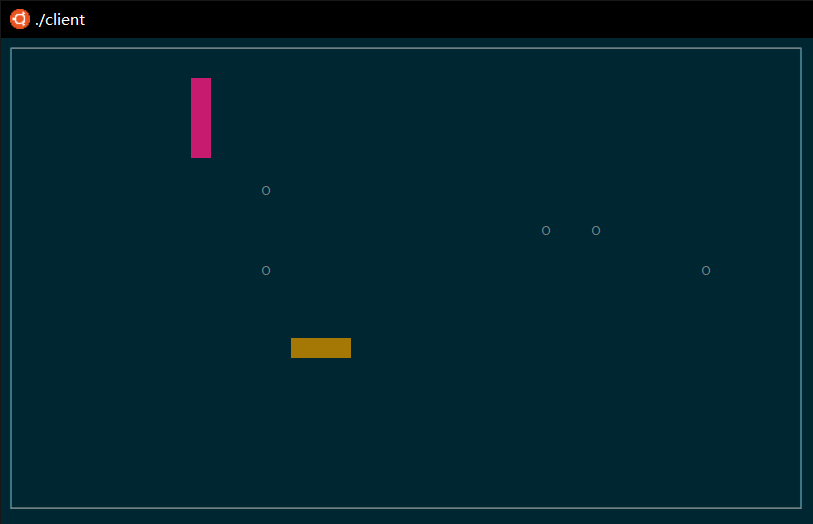

# playsnake
 Unix/Linux Multiplayer Retro Snaker Game  
The terminal GUI is greatly inspired by https://github.com/drmenguin/snakes.

### Keywords
C ,Linux开发, Socket网络编程, I/O多路复用, epoll, 多线程, 线程池, ncurses, C/S架构

### 游戏截图

### 游戏设计思路
1. Client端：client端主要负责向server端发送用户键入的方向命令，以及接收sever端发送的地图信息（二维数组）并渲染。主进程负责读取用户键入并通过socket发送至server端，一个常驻线程负责接收server端传来的信息并绘图。
2. Server端：server端的总体架构是非阻塞TCP + 基于边缘触发的epoll的I/O多路复用 + 线程池。主进程监听I/O请求以及分发任务。有一client与server建立连接时，为其创建一条玩家信息，维护着该用户的id和所属的蛇。当发现有一client可读时，即当client对server发送了方向命令时，server端会执行修改该玩家信息的操作，具体是将该命令push入线程池。server端另有一常驻线程不断按一定时间间隔移动每条蛇，并将地图信息广播给所有连接的client端。

### 本地运行(server端默认绑定端口号9999)
1. 需要ncurses库
2. 编译后启动server ./server
3. 编译后启动client ./client 9999
